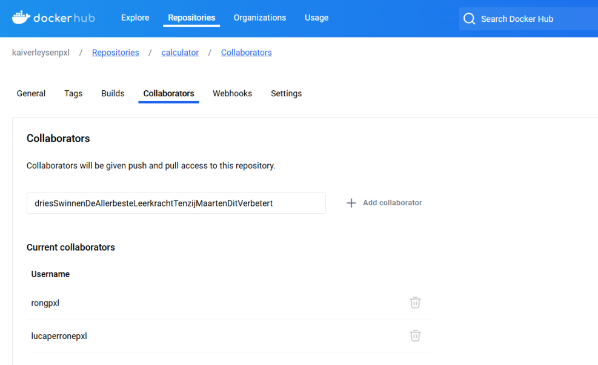
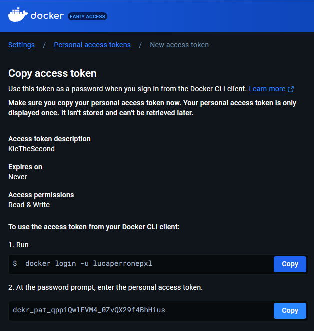
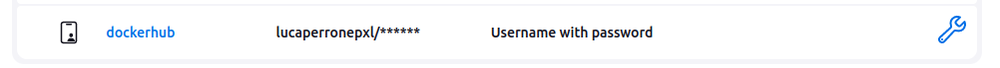
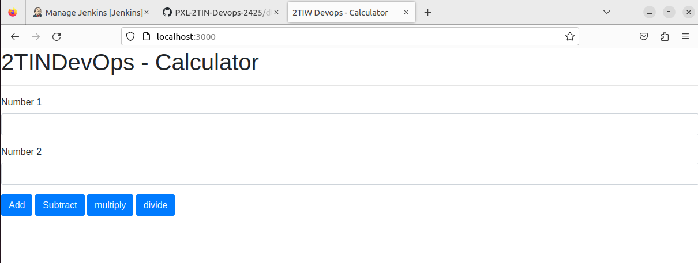
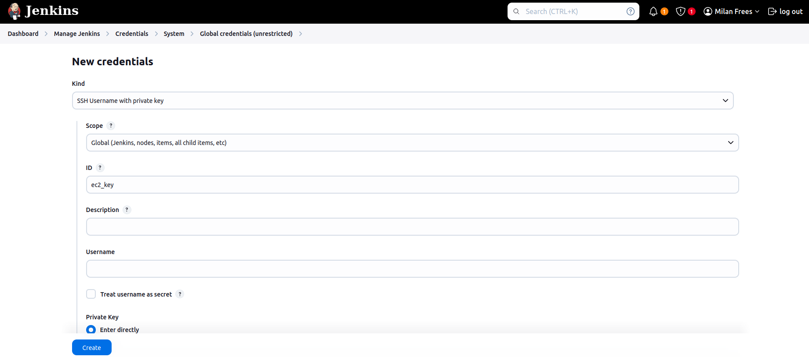

Vul onderstaande aan met de antwoorden op de vragen uit de readme.md file. Wil je de oplossingen file van opmaak voorzien? Gebruik dan [deze link](https://github.com/adam-p/markdown-here/wiki/Markdown-Cheatsheet) om informatie te krijgen over
opmaak met Markdown.

a)

Om op dockerhub te kunnen samenwerken worden de teamleden als collaborators toegevoegd aan de repository:

Hierdoor kan elk teamlid aan de repository.

Om jenkins rechten te geven tot onze docker repository hebben we een access token van docker toegevoegd aan onze jenkins credentials:

Docker token:

Jenkins credentials:

Tijdens het uitvoeren van de test.jenkinsfile wordt een docker container van de calculator applicatie gebouwd en naar dockerhub gepusht.

Na het uitvoeren van de test.jenkinsfile zien we dat de docker container opgestart is op poort 3000 en blijft draaien:

b)

Om jenkins rechten te geven tot onze ec2 instance hebben we de ssh key van de ubuntu server toegevoegd aan onze jenkins credentials:

 SSH key:
